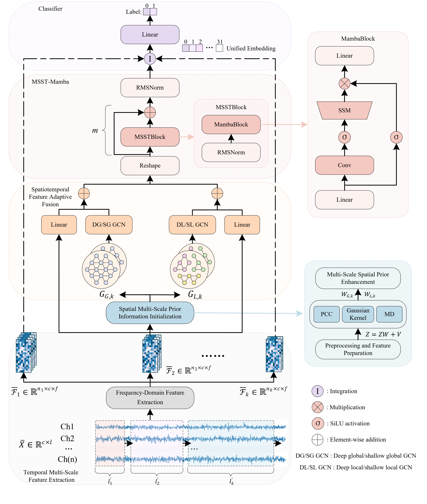

# MSGM: A Multi-Scale Spatiotemporal Graph Mamba for EEG Emotion Recognition

<p align="center">
  
</p>

Paper: https://www.frontiersin.org/journals/neuroscience/articles/10.3389/fnins.2026.1665145/full

MSGM extracts rPSD features from multi-window EEG segments, builds global and
local spatial priors with PCC, Manhattan distance, and Gaussian kernel weights,
and fuses shallow/deep graph encodings with a single-layer MSST-Mamba module
for efficient spatiotemporal emotion classification.

## Repository Layout

```text
MSGM/
|-- figs/
|   `-- framework.jpg
|-- msgm/
|   |-- model.py          # MSGM, spatial priors, multi-depth ChebyNet, MSST-Mamba
|   `-- preprocessing.py  # two-level segmentation and rPSD feature utilities
|-- configs/
|   `-- paper_defaults.yaml
|-- examples/
|   `-- smoke_forward.py  # synthetic forward-pass check
|-- LICENSE
`-- README.md
```

## Method Mapping

| Paper module | Code |
| --- | --- |
| Temporal Multi-Scale Feature Extraction | `msgm/preprocessing.py` |
| Spatial Multi-Scale Prior Information Initialization | `MSGM.build_spatial_priors` |
| Spatiotemporal Feature Adaptive Fusion | `MSGM.fuse_scale` and four graph encoders |
| MSST-Mamba | `MSSTMamba`, `MSSTBlock`, `MambaBlock` |
| Classifier | `MSGM.classifier` |

## Quick Start

Install the core dependencies:

```bash
pip install torch numpy scipy
```

Run a synthetic forward pass:

```bash
python examples/smoke_forward.py
```

The default model uses the 4/3/2/1 second SEED-style multi-scale setting from
the working code, represented after feature extraction by sequence lengths:

```python
scale_lengths = (16, 23, 36, 76)
```

The minimal 4/2/1 setting can be instantiated as:

```python
from msgm import MSGM

model = MSGM(scale_lengths=(16, 36, 76))
```

Each forward input is an rPSD feature tensor with shape
`(batch, sequence_length, channels, frequency_bands)`.

The implementation supports 62-channel SEED-style and 32-channel
THU-EP/FACED-style montages through predefined region maps. For a different
montage, pass `region_ids` to `MSGM`.

## Acknowledgements

This code was developed from an experimental workspace derived from the EmT
codebase. The EmT-derived portions are distributed under the CBCR License 1.0;
see `LICENSE`.

## Citation

Liu H, Gong Y, Yan Z, Zhuang Z and Lu J (2026) MSGM: a multi-scale
spatiotemporal graph Mamba for EEG emotion recognition. Front. Neurosci.
20:1665145. doi: 10.3389/fnins.2026.1665145

```bibtex
@article{liu2026msgm,
  title = {MSGM: a multi-scale spatiotemporal graph Mamba for EEG emotion recognition},
  author = {Liu, Hanwen and Gong, Yifeng and Yan, Zuwei and Zhuang, Zeheng and Lu, Jiaxuan},
  journal = {Frontiers in Neuroscience},
  volume = {20},
  pages = {1665145},
  year = {2026},
  doi = {10.3389/fnins.2026.1665145}
}
```
